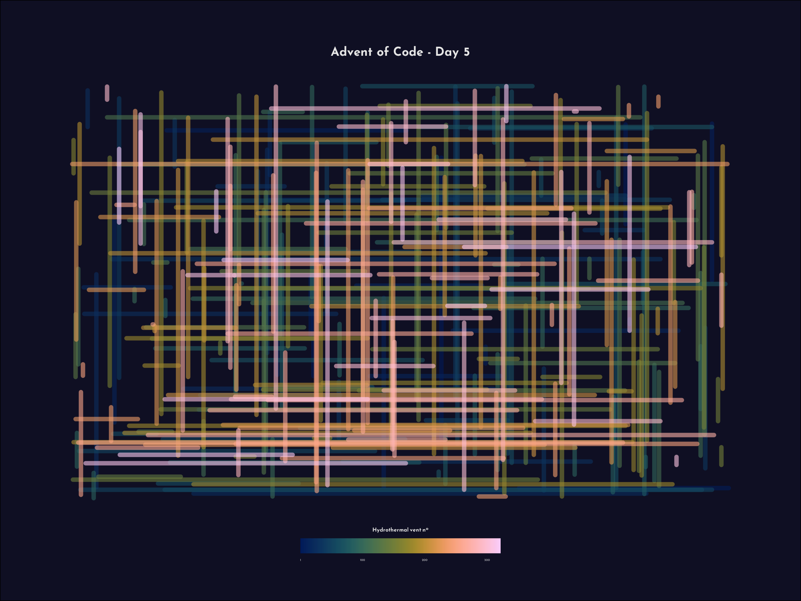
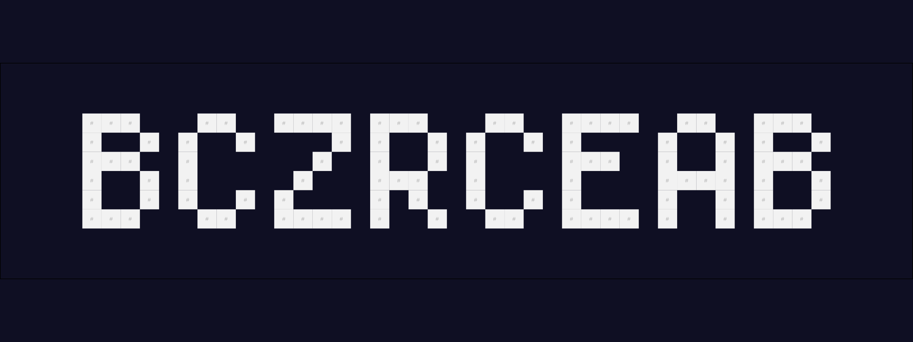

```{r setup, include=FALSE}
library(tidyverse)
library(tictoc)
knitr::opts_chunk$set()
xaringanExtra::use_panelset()
```

```{css, echo=FALSE}
.panel-tab {
  flex: 1 0 20%;
  text-align: center;
}

p {
  color: #cccccc;
}

p a {
  color: rgb(0, 153, 0);
}
p a:hover {
  color: #99ff99;
}
```

```{r, echo=FALSE}
part1 <- fs::dir_ls("./2021/", recurse = TRUE) %>%
  str_subset("_pt1") %>%
  str_extract(., "(?<=script_day)(.*)(?=_pt)") %>%
  as.numeric()

part2 <- fs::dir_ls("./2021/", recurse = TRUE) %>%
  str_subset("_pt2") %>%
  str_extract(., "(?<=script_day)(.*)(?=_pt)") %>%
  as.numeric()

one_done <- setdiff(setdiff(1:25, part2), setdiff(1:25, part1))
none_done <- intersect(setdiff(1:25, part2), setdiff(1:25, part1))

htmltools::tags$style(
  str_c(collapse = "\n",
    c(
      glue::glue(
        "#panelset_day-[one_done] {color: #EBB626 !important;}",
        .open = "[", .close = "]"
      ),
      glue::glue(
        "#panelset_day-[none_done] {color: #D63131 !important;}",
        .open = "[", .close = "]"
      )
    )
  )
)
```

::::: {.panelset}

::: {.panel}

# Day 1 {.panel-name}

## Part 1

```{r, code=readLines("./2021/day_01/script_day01_pt1.R"), eval=FALSE}
```

```{r day01pt1, echo=FALSE, cache=TRUE}
tic()
tmp <- eval(parse(text = readLines("./2021/day_01/script_day01_pt1.R")))
toc()
```

## Part 2

```{r, code=readLines("./2021/day_01/script_day01_pt2.R"), eval=FALSE}
```

```{r day01pt2, echo=FALSE, cache=TRUE}
tic()
tmp <- eval(parse(text = readLines("./2021/day_01/script_day01_pt2.R")))
toc()
```

:::

::: {.panel}

# Day 2 {.panel-name}

## Part 1

```{r, code=readLines("./2021/day_02/script_day02_pt1.R"), eval=FALSE}
```

```{r day02pt1, echo=FALSE, cache=TRUE}
tic()
tmp <- eval(parse(text = readLines("./2021/day_02/script_day02_pt1.R")))
toc()
```

## Part 2

```{r, code=readLines("./2021/day_02/script_day02_pt2.R"), eval=FALSE}
```

```{r day02pt2, echo=FALSE, cache=TRUE}
tic()
tmp <- eval(parse(text = readLines("./2021/day_02/script_day02_pt2.R")))
toc()
```

:::

::: {.panel}

# Day 3 {.panel-name}

## Part 1

```{r, code=readLines("./2021/day_03/script_day03_pt1.R"), eval=FALSE}
```

```{r day03pt1, echo=FALSE, cache=TRUE}
tic()
tmp <- eval(parse(text = readLines("./2021/day_03/script_day03_pt1.R")))
toc()
```

## Part 2

```{r, code=readLines("./2021/day_03/script_day03_pt2.R"), eval=FALSE}
```

```{r day03pt2, echo=FALSE, cache=TRUE}
tic()
tmp <- eval(parse(text = readLines("./2021/day_03/script_day03_pt2.R")))
toc()
```

:::

::: {.panel}

# Day 4 {.panel-name}

## Part 1

```{r, code=readLines("./2021/day_04/script_day04_pt1.R"), eval=FALSE}
```

```{r day04pt1, echo=FALSE, cache=TRUE}
tic()
tmp <- eval(parse(text = readLines("./2021/day_04/script_day04_pt1.R")))
toc()
```

## Part 2

```{r, code=readLines("./2021/day_04/script_day04_pt2.R"), eval=FALSE}
```

```{r day04pt2, echo=FALSE, cache=TRUE}
tic()
tmp <- eval(parse(text = readLines("./2021/day_04/script_day04_pt2.R")))
toc()
```

:::

::: {.panel}

# Day 5 {.panel-name}

## Part 1

```{r, code=readLines("./2021/day_05/script_day05_pt1.R"), eval=FALSE}
```

```{r day05pt1, echo=FALSE, cache=TRUE}
tic()
tmp <- eval(parse(text = readLines("./2021/day_05/script_day05_pt1.R")))
toc()
```



## Part 2

```{r, code=readLines("./2021/day_05/script_day05_pt2.R"), eval=FALSE}
```

```{r day05pt2, echo=FALSE, cache=TRUE}
tic()
tmp <- eval(parse(text = readLines("./2021/day_05/script_day05_pt2.R")))
toc()
```

:::

::: {.panel}

# Day 6 {.panel-name}

## Part 1

```{r, code=readLines("./2021/day_06/script_day06_pt1.R"), eval=FALSE}
```

```{r day06pt1, echo=FALSE, cache=TRUE}
tic()
tmp <- eval(parse(text = readLines("./2021/day_06/script_day06_pt1.R")))
toc()
```

## Part 2

```{r, code=readLines("./2021/day_06/script_day06_pt2.R"), eval=FALSE}
```

```{r day06pt2, echo=FALSE, cache=TRUE}
tic()
tmp <- eval(parse(text = readLines("./2021/day_06/script_day06_pt2.R")))
toc()
```

:::

::: {.panel}

# Day 7 {.panel-name}

## Part 1

```{r, code=readLines("./2021/day_07/script_day07_pt1.R"), eval=FALSE}
```

```{r day07pt1, echo=FALSE, cache=TRUE}
tic()
tmp <- eval(parse(text = readLines("./2021/day_07/script_day07_pt1.R")))
toc()
```

## Part 2

```{r, code=readLines("./2021/day_07/script_day07_pt2.R"), eval=FALSE}
```

```{r day07pt2, echo=FALSE, cache=TRUE}
tic()
tmp <- eval(parse(text = readLines("./2021/day_07/script_day07_pt2.R")))
toc()
```

:::

::: {.panel}

# Day 8 {.panel-name}

## Part 1

```{r, code=readLines("./2021/day_08/script_day08_pt1.R"), eval=FALSE}
```

```{r day08pt1, echo=FALSE, cache=TRUE}
tic()
tmp <- eval(parse(text = readLines("./2021/day_08/script_day08_pt1.R")))
toc()
```

## Part 2

Got a lot of help from [Emil Hvitveldt](https://emilhvitfeldt.github.io/rstats-adventofcode/2021.html?panelset=day-8) on this one. Reorganized his solution so I could make sense of it. This one hurt me 🤕

```{r, code=readLines("./2021/day_08/script_day08_pt2.R"), eval=FALSE}
```

```{r day08pt2, echo=FALSE, cache=TRUE}
tic()
tmp <- eval(parse(text = readLines("./2021/day_08/script_day08_pt2.R")))
toc()
```

:::

::: {.panel}

# Day 9 {.panel-name}

## Part 1

```{r, code=readLines("./2021/day_09/script_day09_pt1.R"), eval=FALSE}
```

```{r day09pt1, echo=FALSE, cache=TRUE}
tic()
tmp <- eval(parse(text = readLines("./2021/day_09/script_day09_pt1.R")))
toc()
```

## Part 2

Got stuck here, and once I found this amazingly clever solution from [Ildikó Czeller](https://github.com/czeildi/advent-of-code/blob/main/solutions_2021/day09.R) using `{igraph}`. I wanted to know how this worked, and then I learned from [Jarosław Nirski](https://twitter.com/jnirski) about a similar solution using `{tidygraph}`, which is very neat:

```{r, code=readLines("./2021/day_09/script_day09_pt2.R"), eval=FALSE}
```

```{r day09pt2, echo=FALSE, cache=TRUE}
tic()
tmp <- eval(parse(text = readLines("./2021/day_09/script_day09_pt2.R")))
toc()
```

:::

::: {.panel}

# Day 10 {.panel-name}

## Part 1

```{r, code=readLines("./2021/day_10/script_day10_pt1.R"), eval=FALSE}
```

```{r day10pt1, echo=FALSE, cache=TRUE}
tic()
tmp <- eval(parse(text = readLines("./2021/day_10/script_day10_pt1.R")))
toc()
```

## Part 2

```{r, code=readLines("./2021/day_10/script_day10_pt2.R"), eval=FALSE}
```

```{r day10pt2, echo=FALSE, cache=TRUE}
tic()
tmp <- eval(parse(text = readLines("./2021/day_10/script_day10_pt2.R")))
toc()
```

:::

::: {.panel}

# Day 11 {.panel-name}

Nope, not a chance...

:::

::: {.panel}

# Day 12 {.panel-name}

No idea, sorry!

:::

::: {.panel}

# Day 13 {.panel-name}

## Part 1

```{r, code=readLines("./2021/day_13/script_day13_pt1.R"), eval=FALSE}
```

```{r day13pt1, echo=FALSE, cache=TRUE}
tic()
tmp <- eval(parse(text = readLines("./2021/day_13/script_day13_pt1.R")))
toc()
```

## Part 2

```{r, code=readLines("./2021/day_13/script_day13_pt2.R"), eval=FALSE}
```

```{r day13pt2, echo=FALSE, cache=TRUE}
tic()
tmp <- eval(parse(text = readLines("./2021/day_13/script_day13_pt2.R")))
toc()
```



:::

::: {.panel}

# Day 14 {.panel-name}

## Part 1

With some help once again from [Ildikó Czeller](https://github.com/czeildi/advent-of-code/blob/main/solutions_2021/day14.R) 🙌!

```{r, code=readLines("./2021/day_14/script_day14_pt1.R"), eval=FALSE}
```

```{r day14pt1, echo=FALSE, cache=TRUE}
tic()
tmp <- eval(parse(text = readLines("./2021/day_14/script_day14_pt1.R")))
toc()
```

## Part 2

```{r, code=readLines("./2021/day_14/script_day14_pt2.R"), eval=FALSE}
```

```{r day14pt2, echo=FALSE, cache=TRUE}
tic()
tmp <- eval(parse(text = readLines("./2021/day_14/script_day14_pt2.R")))
toc()
```

:::

::: {.panel}

# Day 15 {.panel-name}

Sorry! Guess I need to dive into `{tidygraph}` a bit more.

:::

::: {.panel}

# Day 16 {.panel-name}

Nope, no idea!

:::

::: {.panel}

# Day 17 {.panel-name}

## Part 1

```{r, code=readLines("./2021/day_17/script_day17_pt1.R"), eval=FALSE}
```

```{r day17pt1, echo=FALSE, cache=TRUE}
tic()
tmp <- eval(parse(text = readLines("./2021/day_17/script_day17_pt1.R")))
toc()
```

## Part 2

I really admire [Ildikó Czeller](https://github.com/czeildi/advent-of-code/blob/main/solutions_2021/day17.R)'s neat and tidy solution here, which (with some trial-and-error) worked beautifully!

```{r, code=readLines("./2021/day_17/script_day17_pt2.R"), eval=FALSE}
```

```{r day17pt2, echo=FALSE, cache=TRUE}
tic()
tmp <- eval(parse(text = readLines("./2021/day_17/script_day17_pt2.R")))
toc()
```

:::

::: {.panel}

# Day 18 {.panel-name}

:::

::: {.panel}

# Day 19 {.panel-name}

:::

::: {.panel}

# Day 20 {.panel-name}

:::

::: {.panel}

# Day 21 {.panel-name}

:::

::: {.panel}

# Day 22 {.panel-name}

:::

::: {.panel}

# Day 23 {.panel-name}

:::

::: {.panel}

# Day 24 {.panel-name}

:::

::: {.panel}

# Day 25 {.panel-name}

:::

:::::
